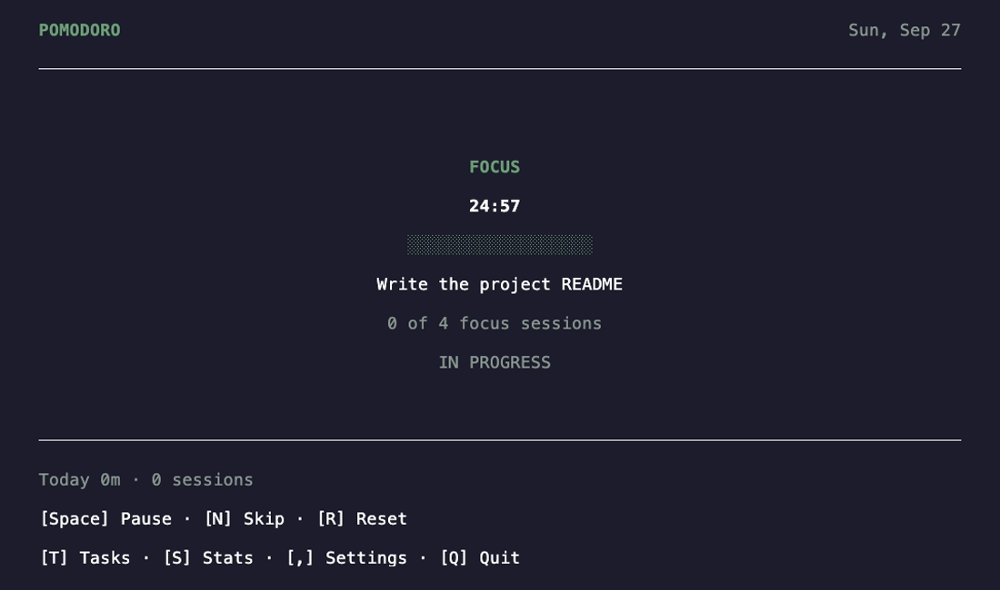

# Pomodoro

[](https://github.com/m0hdrar/pomodoro_tui/releases)
[](LICENSE)


A keyboard-first Pomodoro timer for your terminal, built with [Bun](https://bun.sh) and [OpenTUI](https://github.com/sst/opentui).



## Features

- **Focus timer:** focus sessions, short breaks and long breaks, controlled from the keyboard
- **Tasks:** attach each focus session to the task you are working on
- **Stats:** today's completed sessions and your session history
- **Notifications:** desktop alerts when an interval ends, if your terminal supports them
- **Local storage:** no account and no cloud; your data stays on your machine

## Installation

Install with [Homebrew](https://brew.sh):

```sh
brew install m0hdrar/tap/pomodoro
```

Then run:

```sh
pomodoro
```

Supports macOS on Apple Silicon and Intel.

### As a herdr plugin

Run Pomodoro in a [herdr](https://herdr.dev) pane (needs [Bun](https://bun.sh)):

```sh
herdr plugin install m0hdrar/pomodoro_tui
```

Bind a key that jumps to the Pomodoro pane (and opens one if none is open) in `~/.config/herdr/config.toml`:

```toml
[[keys.command]]
key = "prefix+m"
type = "plugin_action"
command = "m0hdrar.pomodoro.open"
description = "pomodoro"
```

### Timer in the herdr tab bar

`pomodoro status` prints the running timer as one line, such as `Focus 12:34`, and prints nothing when Pomodoro isn't open. To show it at the right of herdr's tab bar, add this to `~/.config/herdr/config.toml`:

```toml
[ui]
tab_bar_right = [
  { type = "command", command = "pomodoro status", interval_seconds = 1, timeout_seconds = 2 },
]
```

Then run `herdr server reload-config`.

## Usage

### Timer

| Key | Action |
| --- | --- |
| `Space` | Start, pause or resume |
| `N` | Skip to the next interval |
| `r` | Reset the current interval |
| `R` | Reset the whole cycle (back to focus, session count to 0) |
| `T` | Open tasks |
| `S` | Open stats |
| `,` | Open settings |
| `Q` / `Ctrl+C` | Save and quit |

### Tasks

| Key | Action |
| --- | --- |
| `↑` / `↓` | Move through tasks |
| `A` | Add a task |
| `Enter` | Select the highlighted task |
| `C` | Complete the highlighted task |
| `Esc` | Go back |

### Settings

| Key | Action |
| --- | --- |
| `↑` / `↓` | Move through settings |
| `←` / `→` | Change the selected value |
| `Space` | Turn the selected option on or off |
| `Esc` | Go back |

## Configuration

| Setting | Default |
| --- | --- |
| Focus | 25 minutes |
| Short break | 5 minutes |
| Long break | 15 minutes |
| Long break after | 4 focus sessions |
| Auto-start next interval | Off |
| Desktop notifications | On |

You can change these settings in the app by pressing `,`.

### Notifications

Pomodoro sends desktop notifications with OSC 9, 777 and 99 escape sequences, so they only appear in terminals that support these sequences. Some extra notes:

- **herdr:** notifications go through `herdr notification show`, so they follow herdr's `[ui.toast] delivery` setting (`system` for macOS banners).
- **tmux:** add `set -g allow-passthrough on` to your tmux config so notifications reach your terminal.
- **Turning them off:** set `OPENTUI_NOTIFICATIONS=0` in your environment.

### Data

Your settings, tasks and session history are saved to one file:

```text
~/Library/Application Support/pomodoro_tui/state.json
```

A running timer is saved as paused when you quit. If the file is corrupted, Pomodoro shows an error and does not overwrite it.

## Development

Requires [Bun](https://bun.sh) 1.3 or newer.

```sh
bun install
bun run dev          # run with hot reload
bun test             # run the tests
bun run typecheck    # check types
```

### Releasing

```sh
scripts/release.sh 0.2.0
```

This command does three things:

- Builds the macOS binaries
- Publishes a GitHub release
- Updates the formula in [m0hdrar/homebrew-tap](https://github.com/m0hdrar/homebrew-tap)

## License

[MIT](LICENSE)
